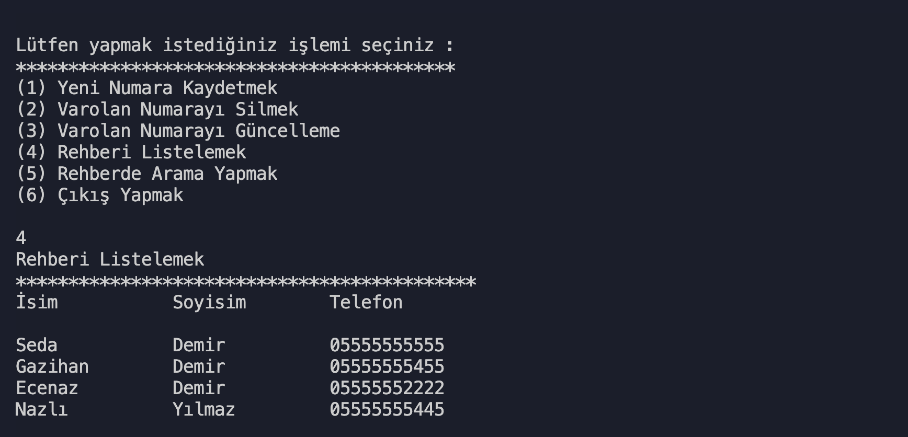
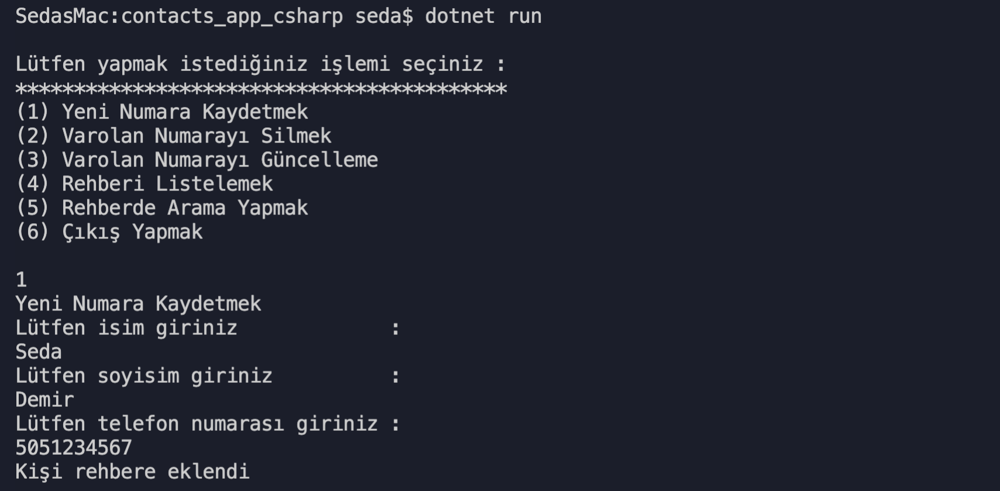
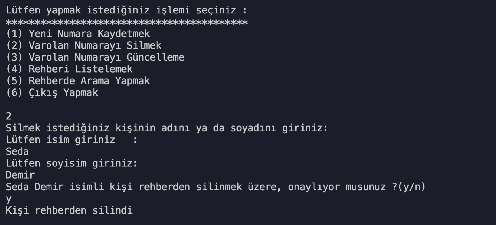
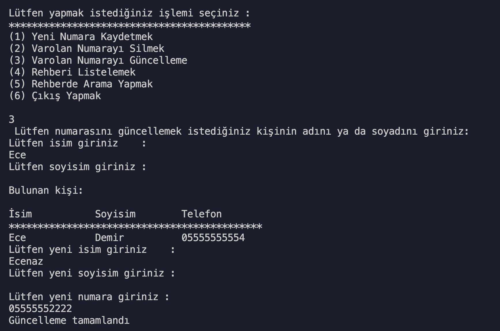

# Kodluyoruz C# Project 1

## Telefon Rehberi Uygulaması

Contact adında bir obje Class'ı ve ContactsOperations adında yardımcı methodları içeren bir class oluşturuldu. Program.cs içinde ise uygulamanın logic'i tutuldu. Sorumluluklar parçalandı ve kod okunabilirliği sağlandı.

### Rehberdeki kişileri listelemek

### Rehbere yeni kişi eklemek

### Rehberden kişi silmek

### Rehberde kişi güncellemek

### Rehberde kişi aramak

