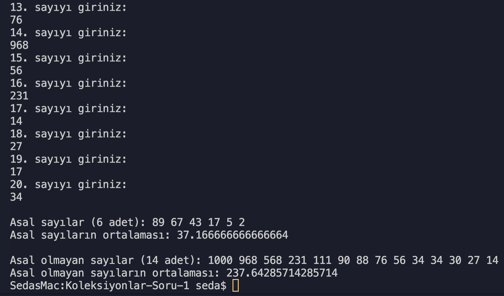

# Koleksiyonlar Soru 1

- [x] Klavyeden girilen 20 adet pozitif sayının **asal ve asal olmayan**
      olarak 2 ayrı listeye atın. (**ArrayList** sınıfını kullanarak yazınız.)

- [x] Negatif ve numeric olmayan girişleri engelleyin.
- [x] Her bir dizinin elemanlarını büyükten küçüğe olacak şekilde ekrana yazdırın.
- [x] Her iki dizinin eleman sayısını ve ortalamasını ekrana yazdırın.

## Ekran Çıktısı

