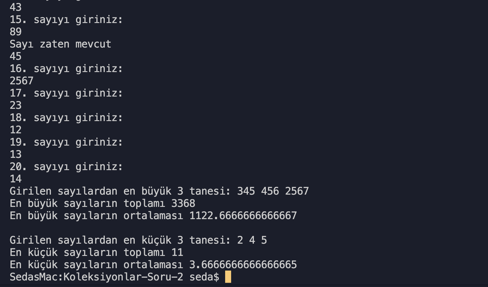

# Koleksiyonlar Soru 2

- [x] Klavyeden girilen 20 adet sayının en büyük 3 tanesi
      ve en küçük 3 tanesi bulan,

- [x] Her iki grubun kendi içerisinde
      ortalamalarını alan,
- [x] Bu ortalamaları ve ortalama toplamlarını
      console'a yazdıran programı yazınız. (**Array** sınıfını kullanarak yazınız.)

## Ekran Çıktısı

