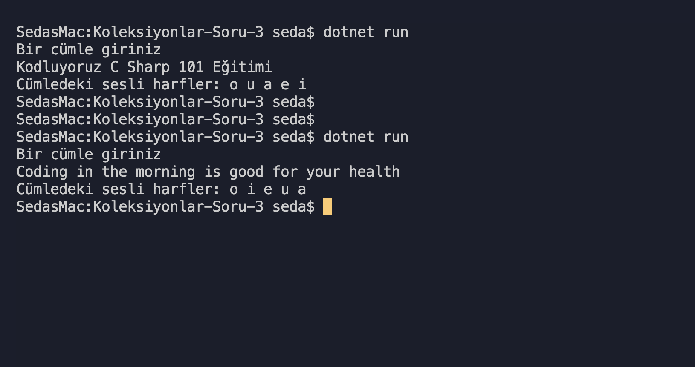

# Koleksiyonlar Soru 3

- [x] Klavyeden girilen cümle içerisindeki sesli harfleri
      bir dizi içerisinde saklayan,

- [x] Dizinin elemanlarını
      sıralayan programı yazınız.

## Ekran Çıktısı

