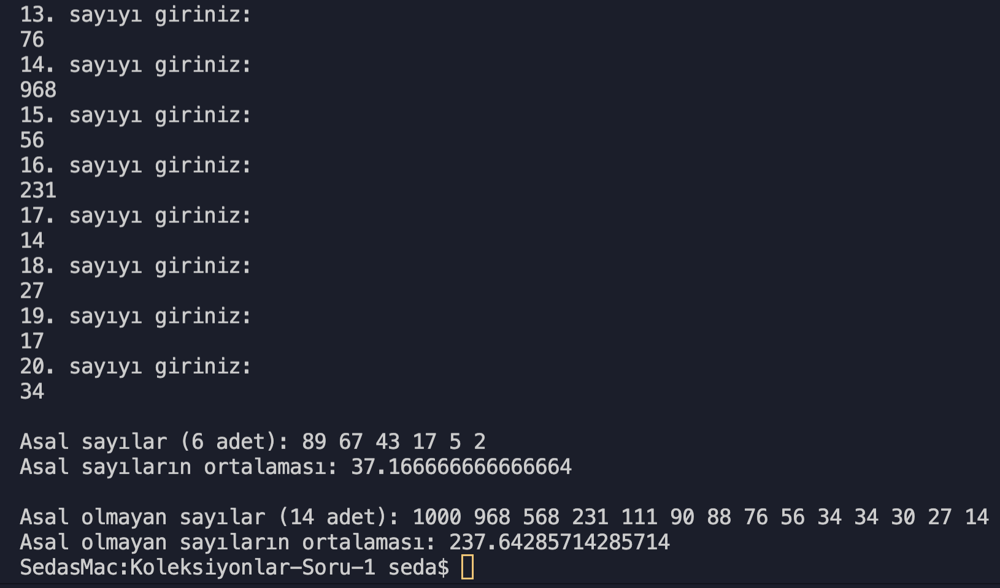

# Koleksiyonlarla ilgili alıştırmalar

- **Array**, **ArrayList** kullanımı
- <code>Contains()</code>, <code>Sort()</code>, gibi koleksiyon metodlarının kullanımı
- CalculateAverage(), CalculateSum() ve findPrimes() metotları tanımlanması

## Koleksiyonlar Soru 1 Çözümü Ekran Çıktısı

[Daha fazla](https://github.com/dseda/kodluyoruz-csharp/tree/main/odev-2/Koleksiyonlar-Soru-1)

## Koleksiyonlar Soru 2 Çözümü Ekran Çıktısı

[Daha fazla](https://github.com/dseda/kodluyoruz-csharp/tree/main/odev-2/Koleksiyonlar-Soru-2)

## Koleksiyonlar Soru 3 Çözümü Ekran Çıktısı

[Daha fazla](https://github.com/dseda/kodluyoruz-csharp/tree/main/odev-2/Koleksiyonlar-Soru-3)
