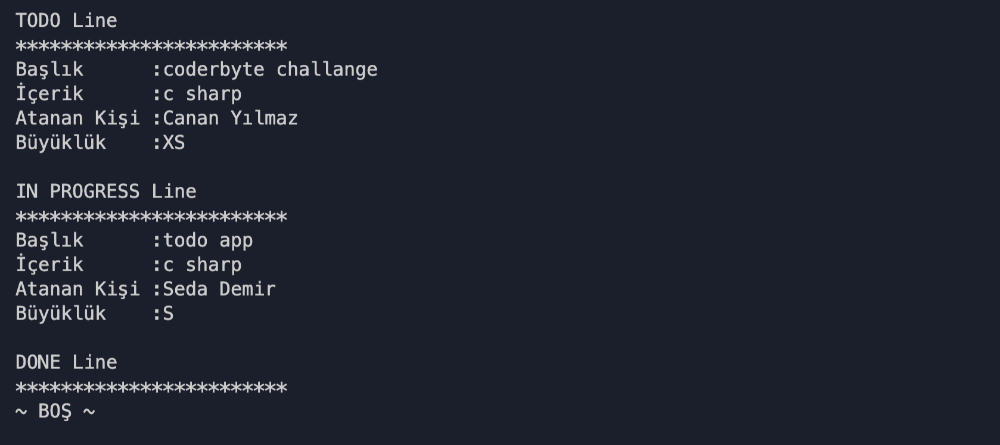

# Kodluyoruz C# Project 2

## Todo Uygulaması

Todo adında bir obje Class'ı ve TodoOperations adında yardımcı methodları içeren bir class oluşturuldu. Program.cs içinde ise uygulamanın logic'i tutuldu. Sorumluluklar parçalandı ve kod okunabilirliği sağlandı.

### Todo'ları durumlarına (status/line) göre listelemek

### Yeni bir todo oluşturmak

### Todo silmek - silme adımları

### Todo silmek - todo silindikten sonra

### Todo durum bilgisi güncellemek - adımlar

### Todo durum bilgisi güncellemek - güncelleme sonrası

